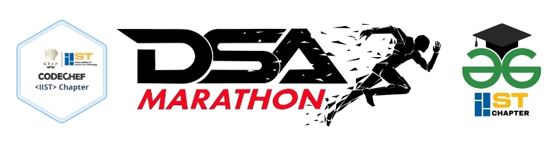

 

 
 

<b>Full fledged DSA Marathon from zero to Hundred. Enhance Your Data Structure and Algorithm knowledge with us.
A Collaboration Event Series by GFG IIST Chapter and CodeChef IIST Chapter
</b>

- [Resistration Form](https://docs.google.com/forms/d/e/1FAIpQLSeSWXG04wekDV13L_nrPYsMSdRyhbCcRsWQkzdfNg_iTSHc_w/viewform)
- [Syllabus](Syllabus.md)
- [Faqs](faqs.md)
- [Code of Conduct](Code_of_Conduct.md)
- [How to get started](Get_Stated.md)
### Topics
- [Git and Github](/Git_and_Github)
- [Array](/Array)

## Follow for More Update
<h2 align='center'><a href='https://linktr.ee/dsa_marathon'> DSA MARATHON </a></h2>

<h3 align='center'> &nbsp;&nbsp;@CodeIISTChapter &nbsp;&nbsp;&nbsp;&nbsp;&nbsp;&nbsp;&nbsp;&nbsp;&nbsp;&nbsp;&nbsp;&nbsp;&nbsp;&nbsp;&nbsp;&nbsp;&nbsp;&nbsp; @GFGIISTChapter</h3>

&nbsp;&nbsp;&nbsp;
&nbsp;&nbsp;&nbsp;&nbsp;
&nbsp;&nbsp;&nbsp;&nbsp;

&nbsp;&nbsp;&nbsp;&nbsp;&nbsp;&nbsp;&nbsp;&nbsp;&nbsp;&nbsp;&nbsp;&nbsp;&nbsp;&nbsp;&nbsp;&nbsp;
&nbsp;&nbsp;&nbsp;&nbsp;
&nbsp;&nbsp;&nbsp;&nbsp;

<!-- ### All amazing members of these series -->
 <!-- <table>
 <tr>
   <td>
    
    </a>
  </td>
 </tr>
</table>  -->

<h1 align=center> Happy Coding 👨‍💻 </h1>
